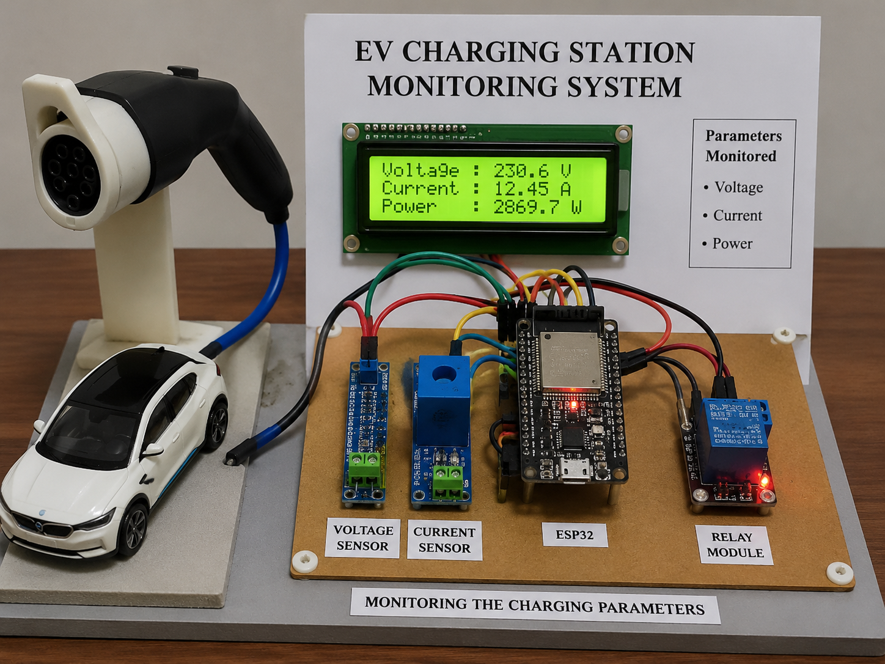

## About the Project

The EV Charging Station Monitoring System is an IoT-based project designed to monitor important electrical parameters during EV charging.

## Objectives

- Monitor voltage during EV charging.
- Monitor charging current.
- Calculate charging power.
- Improve charging safety and efficiency.

## Technologies Used

- ESP32
- IoT
- Java
- Arduino IDE
- Sensors

## Working

1. The charging parameters are collected from the charging system.
2. ESP32 acts as the main controller.
3. Voltage and current values are monitored.
4. Power is calculated using voltage and current.
5. The monitored values help understand the charging condition.

## Features

- Voltage monitoring
- Current monitoring
- Power calculation
- Real-time monitoring
- ESP32-based system

## Future Scope

- Cloud-based monitoring
- Mobile application
- Remote monitoring
- Fault detection

 ## Java Working Demo

The project also includes a Java-based monitoring program to demonstrate the calculation of charging power.

### Sample Input
- Voltage: 230 V
- Current: 10 A

### Output
- Power: 2300 W

Power is calculated using:

Power = Voltage × Current
## How to Run

1. Install Java JDK on your system.
2. Open the project folder in VS Code or Command Prompt.
3. Compile the Java program:

javac EVChargingMonitoring.java
4. Run the program:

java EVChargingMonitoring

5. Enter the voltage and current values when prompted.

6. The system calculates and displays the charging power.
## Prototype Image

